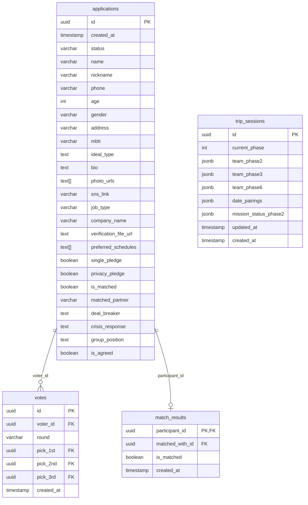

# Signal Trip Master Blueprint & Technical Specification

본 문서는 48시간 오프라인 블라인드 데이트 이벤트 **'Signal Trip'**의 참가자용 모바일 웹앱 및 호스트용 실시간 관제 어드민(Admin) 시스템의 마스터 블루프린트(바이블)입니다. 프로젝트의 핵심 비즈니스 로직, 기술 아키텍처, 데이터베이스 모델, 그리고 핵심 알고리즘 세부 명세를 포함합니다.

---

## 1. 프로젝트 개요 및 코어 비즈니스 로직

### 1-1. 서비스 정체성
* **Signal Trip**은 참가자들이 48시간 동안 다양한 팀 미션과 1:1 데이트를 거쳐 최종 커플을 매칭하는 실시간 오프라인 행사 연동 웹 애플리케이션입니다. 
* 참가자들은 스마트폰 모바일 뷰로 접속하여 정해진 미션과 투표를 진행하며, 주최측(호스트)은 데스크톱 웹 대시보드를 통해 현장 전체 상황을 관제 및 통제합니다.

### 1-2. 핵심 제어 원칙 (하이브리드 페이즈 전환)
* **하이브리드 페이즈 제어**:
  - 기존의 강제 일제 화면 전환 방식에서 탈피하여, 글로벌 DB 페이즈(`globalPhase`)와 참가자의 로컬 화면 뷰 페이즈(`localViewPhase`)를 이중화하여 관리합니다.
  - 호스트가 어드민 대시보드(`PhaseControlTab`)에서 현재 Phase 상태를 Phase 2로 변경해도 참가자 화면이 강제 전환되지 않고, Phase 1 대기실의 `[여행 시작]` 버튼만 활성화됩니다.
  - 참가자가 이 활성화된 버튼을 직접 클릭해야만 브라우저 스토리지(`signal_trip_started = true`)에 시작 상태가 기록되며, 그제서야 `localViewPhase`가 2로 갱신되어 `Phase2TeamMission` 화면이 마운트됩니다.
  - Phase 2 이외의 타 페이즈(Phase 3 ~ 8) 전환 시에는 Supabase Realtime 채널을 통해 즉시 `localViewPhase`와 `globalPhase`가 글로벌 동기화되어 화면이 강제 전환됩니다.

### 1-3. 보안 및 오작동 방어 (Fail-Safe)
* **어드민 접근 제한 (`AdminProtectedRoute`)**:
  - 비밀번호 입력 방식 가드를 구현하여 무단 접속을 차단합니다. 브라우저 세션에 인증 상태를 유지하고, 환경변수 `VITE_ADMIN_PASSWORD` (기본값: `'signal1234'`) 정보로 대조합니다.
* **이중 확인 페이즈 제어**:
  - 호스트가 Phase 변경 버튼을 누를 때 발생할 수 있는 오클릭 사고를 막기 위해 **"이중 확인 모달"**을 노출하여 안전 장치를 제공합니다.
* **노쇼(No-Show) 대비 긴급 봇 인젝션**:
  - 오프라인 당일 불참 인원이 발생해 성비 불균형(남녀 4:4 기본 매칭 구조 붕괴)이 생기면 에러가 날 수 있습니다. 이를 막기 위해 어드민 패널에서 성별을 선택해 **"시그널봇(Dummy Bot)"** 데이터를 `applications` 테이블에 승인 상태(`approved`)로 즉시 인젝션하여 8명 풀을 유지합니다.

---

## 2. 기술 스택 및 환경 변수

### 2-1. 패키지 및 종속성 버전
* **Core Framework**: React `^19.2.6` (TypeScript 환경)
* **Build Tool**: Vite `^8.0.12`
* **Styling**: Tailwind CSS `^4.3.0` (Tailwind Vite Plugin `@tailwindcss/vite` 기반)
* **Database & BaaS Client**: `@supabase/supabase-js` `^2.107.0`
* **Animation**: `framer-motion` `^12.40.0`
* **Icons**: `lucide-react` `^1.17.0`
* **Routing**: `react-router-dom` `^7.17.0`

### 2-2. 환경 변수 구성 (`.env` 규격)
로컬 및 운영 빌드를 위해 프로젝트 루트 디렉토리에 위치해야 하는 환경 변수 파일의 사양입니다.
```bash
# Supabase API 접속 엔드포인트 URL
VITE_SUPABASE_URL=https://ahvwldkwfypugvsuzlto.supabase.co

# Supabase 공개 익명 키
VITE_SUPABASE_ANON_KEY=eyJhbGciOiJIUzI1NiIsInR5cCI6IkpX...

# 어드민 대시보드 진입 비밀번호 (기본값: 'signal1234')
VITE_ADMIN_PASSWORD=signal1234
```

---

## 3. 디렉토리 구조 및 주요 파일의 역할

```
signal-trip/
├── src/
│   ├── components/
│   │   ├── Admin/               # 호스트 관제용 서브 컴포넌트 폴더
│   │   │   ├── AdminSidebar.tsx     # 어드민 전용 내비게이션 사이드바
│   │   │   ├── CRMTab.tsx           # 지원자 심사 및 서류 KYC 미디어 뷰어
│   │   │   ├── PhaseControlTab.tsx  # 페이즈 전환 제어, 타이머 및 Danger Zone 초기화
│   │   │   ├── TeamMixerTab.tsx     # DnD 조 편성 및 1:1 매칭 제어 + 봇 주입
│   │   │   └── VoteViewerTab.tsx    # 투표 집계 리스트 및 SVG 매칭 브릿지 시각화
│   │   ├── Registration/        # 지원서 작성용 서브 컴포넌트 폴더
│   │   │   └── Step3PreInterview.tsx# 취향 매칭 사전 인터뷰 (Q1 ~ Q5)
│   │   ├── WebApp/              # 참가자 전용 웹앱 모바일 뷰 컴포넌트 폴더
│   │   │   ├── WebAppContainer.tsx  # 참가자 메인 컨테이너 (인증, 실시간 페이즈 라우팅, 타임라인 FAB)
│   │   │   ├── mockData.ts          # 클라이언트 Fallback용 Mock 데이터셋 및 타입 정의
│   │   │   ├── Footer.tsx           # 공통 하단 푸터
│   │   │   ├── LegalModal.tsx       # 이용약관 안내 모달
│   │   │   ├── RuleNoticeModal.tsx  # 규칙 서약 안내 모달
│   │   │   ├── Phase0Login.tsx      # 참가자 로그인 (닉네임 + 연락처 뒷자리)
│   │   │   ├── Phase1Lobby.tsx      # 웰컴 대기실 및 하이브리드 여행 시작 버튼
│   │   │   ├── Phase2TeamMission.tsx# 1차 팀 미션, 선착순 공유 인증 및 턴제 대화 카드
│   │   │   ├── Phase3DinnerMission.tsx# 디너 밍글링 4인 1조 화면
│   │   │   ├── Phase4FirstVote.tsx  # 1차 호감도 투표 제출 폼
│   │   │   ├── Phase5DateMission.tsx# 1:1 매칭 데이트 가이드라인
│   │   │   ├── Phase6FinalTeam.tsx  # 최종 팀 미션 4인 1조 화면
│   │   │   ├── Phase7FinalChoice.tsx# 최종 1명 선택 폼 제출 모달
│   │   │   └── Phase8Result.tsx     # 최종 커플 성사/위로 발표 화면
│   │   ├── AdminDashboard.tsx   # 어드민 메인 대시보드 뷰어 및 레이아웃
│   │   ├── HeroSection.tsx      # 서비스 소개 및 랜딩 페이지 메인 히어로 섹션
│   │   ├── RegistrationModal.tsx# 5단계 신청서 작성 모달 (파일 업로드 & 유효성 검증)
│   │   ├── Step1BasicInfo.tsx   # 신청서 Step 1: 기본 인적사항 입력
│   │   ├── Step2SignalProfile.tsx# 신청서 Step 2: 자기소개, SNS 및 사진 업로드
│   │   ├── Step3JobVerification.tsx# 신청서 Step 4: 직무 선택 및 KYC 증빙서류 업로드
│   │   ├── Step4ScheduleConsent.tsx# 신청서 Step 5: 희망일정 선택 및 미혼/개인정보 동의
│   │   └── SubmissionSuccess.tsx# 신청서 최종 제출 완료 축하 화면
│   ├── App.tsx                  # 최상위 라우팅 허브 (보안 라우터 게이트웨이 탑재)
│   ├── main.tsx                 # 어플리케이션 엔트리 포인트
│   ├── supabaseClient.ts        # Supabase 클라이언트 SDK 초기화 파일 및 타입 구조 선언
│   └── index.css                # 글로벌 테마 및 리셋 스타일 CSS
├── package.json                 # 의존성 및 빌드 스크립트 정의
└── vite.config.ts               # Vite 설정 및 플러그인 로드
```

---

## 4. 데이터베이스 스키마 및 상태 관리 (Supabase)

### 4-1. 관계형 스키마 구조



#### 1) `applications` 테이블 (참가자 지원서 및 정보)
* **역할**: 참가자의 가입 정보, 인적사항, 프로필 이미지 URL, 직무 증빙용 KYC 서류 주소, 취향 설문 및 매칭 백업 상태를 저장합니다.
* **주요 컬럼**:
  - `id` (uuid, PK)
  - `status` (varchar, 기본값: `'pending'`): 대기(`pending`), 승인(`approved`), 거절(`rejected`), 이전 기수 보관(`archived`) 중 하나를 가집니다.
  - `gender` (varchar): `MALE` 또는 `FEMALE`
  - `preferred_schedules` (text[]): 참가 신청 시 선택한 희망 일정 배열
  - `photo_urls` (text[]): Supabase `profile_photos` 스토리지에 업로드된 참가자 프로필 사진 URL 목록
  - `verification_file_url` (text): Supabase `verification_docs` 스토리지에 업로드된 KYC 신원/직무 증빙 서류 URL
  - `deal_breaker` (text): 취향 매칭 설문 3단계 질문 데이터의 결합 필드 (Q1 + Q4 지뢰 식재료)
  - `crisis_response` (text): 취향 매칭 설문 3단계 질문 데이터의 결합 필드 (Q2 + Q5 소울푸드)
  - `group_position` (text): 취향 매칭 설문 3단계 질문 데이터의 결합 필드 (조 내 포지션 + Q3 첫날 디너)
  - `is_matched` / `matched_partner` (boolean / varchar): 기수 데이터 하드 리셋 시 이전 기수 매칭 성공 여부 및 상대 닉네임을 아카이빙하기 위한 백업용 필드

#### 2) `trip_sessions` 테이블 (글로벌 48시간 라이브 세션 상태)
* **역할**: 현재 실시간 진행 중인 Phase 정보와 각 Phase별 팀(조) 편성 및 팀 공유 상태 데이터를 보관합니다.
* **주요 컬럼**:
  - `id` (uuid, PK)
  - `current_phase` (int, 기본값: `1`): `1`부터 `8`까지의 글로벌 상태 값.
  - `team_phase2` / `team_phase3` / `team_phase6` (jsonb): 각 페이즈별 조 편성 정보 (`{ "team_a": [id1, id2...], "team_b": [id3, id4...] }`)
  - `date_pairings` (jsonb): 1:1 매칭 커플 정보 (`{ "maleId": "femaleId" }`)
  - `mission_status_phase2` (jsonb, 기본값: `{}`): A/B팀별 사진 미션 인증 완료 상태 기록 컬럼 (`{ "team_a": "인증자닉네임", "team_b": null }`)
  - `updated_at` (timestamp): 실시간 타이머 계산 기준일시.

#### 3) `votes` 테이블 (1차 및 최종 투표 기록)
* **역할**: 참가자가 Phase 4 및 Phase 7에서 제출한 이성 선택표를 기록합니다.
* **주요 컬럼**:
  - `id` (uuid, PK)
  - `voter_id` (uuid, FK ➔ `applications.id`): 투표를 한 참가자.
  - `round` (varchar): 1차 투표 (`first`) 또는 최종 투표 (`final`).
  - `pick_1st` (uuid, FK ➔ `applications.id`): 1순위 선택 이성.
  - `pick_2nd` / `pick_3rd` (uuid, FK, Nullable): 2순위, 3순위 선택 이성.

#### 4) `match_results` 테이블 (최종 매칭 결과 저장소)
* **역할**: Phase 8 공개 준비 단계에서 호스트가 확정한 최종 결과를 저장합니다.
* **주요 컬럼**:
  - `participant_id` (uuid, PK, FK ➔ `applications.id`): 해당 참가자.
  - `matched_with_id` (uuid, FK ➔ `applications.id`, Nullable): 매칭 성사된 상대방 ID. (매칭 실패 시 `null`)
  - `is_matched` (boolean): 매칭 성공 여부. (성비 8명 전원의 상태를 일괄 upsert 해야 함)

### 4-2. Realtime 웹소켓 채널 구독 로직
참가자 컨테이너(`WebAppContainer.tsx`)는 마운트 시 아래 채널을 실시간 구독하여 데이터가 업데이트(UPDATE/INSERT)되는 즉시 화면을 갱신합니다.
```typescript
const channel = supabase
  .channel('trip-session-realtime')
  .on(
    'postgres_changes',
    { event: '*', schema: 'public', table: 'trip_sessions' },
    (payload) => {
      const newData = payload.new as Record<string, any>;
      if (newData) {
        setSessionData(newData as TripSession);
        const newGlobal = newData.current_phase;
        if (typeof newGlobal === 'number') {
          setGlobalPhase(newGlobal); // 글로벌 상태는 무조건 동기화

          if (newGlobal === 1) {
            // 초기화 시 로컬 스토리지에 남아있던 Phase 2 임시 상태 제거
            localStorage.removeItem('signal_phase2_step');
            localStorage.removeItem('signal_phase2_mission_started');
            localStorage.removeItem('signal_trip_phase2_state');
            localStorage.removeItem('signal_phase2_random_animal');
            localStorage.removeItem('signal_trip_started');
          }

          setLocalViewPhase((prevLocal) => {
            // 관리자가 페이즈를 뒤로 돌린 경우 (Rollback) -> 강제로 참가자 화면도 동기화 (Force Sync)
            if (newGlobal < prevLocal) {
              localStorage.setItem('signal_local_phase', String(newGlobal));
              return newGlobal;
            }
            // 그 외의 경우 (전진) -> 기존 화면 유지 (하이브리드 버튼 클릭 시 진입되도록 분화)
            return prevLocal;
          });
        }
      }
    }
  )
  .subscribe();
```

---

## 5. UI/UX Flow 및 세부 기능 명세

### 5-1. 서비스 소개 랜딩 페이지 및 지원서 등록 폼 (Landing & Registration)
* **메인 랜딩 페이지 (`HeroSection.tsx`)**:
  - 오프라인 48시간 블라인드 데이트 이벤트 'Signal Trip'의 메인 브랜딩 및 가이드 소개.
  - '참가 신청하기' 클릭 시 등록 모달(`RegistrationModal`) 오픈.
* **5단계 신청서 프로세스 (`RegistrationModal.tsx`)**:
  1. **1단계: 기본인증 (`Step1BasicInfo.tsx`)**: 본명, 닉네임, 연락처(10~11자리), 나이(만 19세 이상 가드), 성별, 거주지, MBTI 형식 검사.
  2. **2단계: 프로필 (`Step2SignalProfile.tsx`)**: 이상형 입력, 자기소개 글쓰기, 프로필 사진 업로드, SNS 계정 링크 입력.
  3. **3단계: 인터뷰 (`Step3PreInterview.tsx`)**: 성향 및 취향 매칭용 사전 질문 구성.
     - 제주 오후 2시 선호 공간(Q1), 첫날 아침 여행 스타일(Q2), 모임 내 역할 포지션, 첫날 디너 음식점 종류(Q3), 기피 식재료/지뢰 음식(Q4), 제주 소울푸드(Q5).
  4. **4단계: 신원인증 (`Step3JobVerification.tsx`)**: 직무 유형 선택, 직장/상호명 입력, 신원 및 재직 KYC 증빙서류 이미지 업로드.
  5. **5단계: 서약완료 (`Step4ScheduleConsent.tsx`)**: 복수 희망 일정 선택, 미혼 서약 동의, 개인정보 활용 동의 후 최종 제출.
* **스토리지 연동**:
  - 프로필 이미지 ➔ Supabase `profile_photos` 버킷 업로드 후 URL 리스트 DB 바인딩.
  - 증빙 서류 이미지 ➔ Supabase `verification_docs` 버킷 업로드 후 URL 단일 DB 바인딩.
* **인터뷰 결합 데이터 저장 규격**:
  - `deal_breaker`: `"Q1: [Q1 답변] / Q4 지뢰: [Q4 답변]"`
  - `crisis_response`: `"Q2: [Q2 답변] / Q5 소울: [Q5 답변]"`
  - `group_position`: `"포지션: [포지션 답변] / Q3: [Q3 답변]"`

### 5-2. 참가자 웹앱 (Phase 0 ~ Phase 8)
모바일 브라우저에 최적화된 모바일 전용 컨테이너(`max-w-md mx-auto`) 형태로 구현되어 있습니다.

* **Phase 0 (인증 - `Phase0Login.tsx`)**: 닉네임 + 연락처 뒷 4자리를 `applications` 테이블에서 조회하여 승인 상태 확인 후 로컬 스토리지에 세션 보존.
* **Phase 1 (대기실 - `Phase1Lobby.tsx`)**: 애니메이션으로 환영 편지를 보여주며 긴장감 조성. `globalPhase === 2` 상태가 충족되면 활성화 민트색 그라데이션 및 박동 애니메이션이 들어간 `[여행 시작]` 버튼이 열리며, 클릭 시 Phase 2 미션 페이지로 진입 가능.
* **Phase 2 (1차 팀 미션 - 4인 1조 - `Phase2TeamMission.tsx`)**:
  - **선착순 팀 공유 인증 (Shared State Photo verification)**:
    - 상단 행동 미션 영역에 `[📸 1단계: 사진 인증 업로드]` 카드가 활성화됩니다.
    - 내 ID가 속한 팀(`team_a`/`team_b`)의 완료 여부를 `sessionData.mission_status_phase2` 에서 감지하여, 미인증 시에는 1.5초 시뮬레이션 업로드 후 DB를 갱신합니다.
    - 팀원 4명 중 누군가가 인증을 마치면 즉시 Realtime으로 다른 팀원들의 화면도 동기화되어 업로드 영역이 **민트색 글로우 네온 카드**로 변하고, 버튼이 비활성화되며 `✅ 미션 완료 ([인증자] 님이 인증함)` 배지가 노출됩니다.
  - **대화 카드 오프라인 턴제 모드 (동적 셔플링)**:
    - 조원 전체(나 포함 4명)의 닉네임 목록을 추출하고, [대화 카드 뽑기]를 누를 때마다 4인 배열을 `sort(() => Math.random() - 0.5)`로 무작위 셔플합니다.
    - 중복 없이 첫 번째를 질문자(`asker`), 두 번째를 답변자(`answerer`)로 지정하여 액션 지시 문구(`🗣️ [질문자]가 👉 [답변자]에게...`)와 함께 질문 내용을 AnimatePresence 페이드 트랜지션으로 렌더링합니다. (인증 완료 여부와 무관하게 로컬에서 개별 작동 유지)
* **Phase 3 (디너 밍글링 - `Phase3DinnerMission.tsx`)**: 새로운 조 편성 공개 및 "시크릿 디너 및 바이닐(Vinyl) 밍글링" 가이드라인 연동.
* **Phase 4 (1차 투표 - `Phase4FirstVote.tsx`)**: 이성 후보 중 1~3순위를 골라 `votes(round='first')` 테이블에 저장.
* **Phase 5 (1:1 매칭 데이트 - `Phase5DateMission.tsx`)**: 호스트가 확정한 데이트 가이드에 따라 미션 수행.
* **Phase 6 (최종 바비큐 미션 - `Phase6FinalTeam.tsx`)**: 최종 4인 1조 밍글링.
* **Phase 7 (최종 선택 - `Phase7FinalChoice.tsx`)**: 최종 1순위 이성 결정 투표 및 `votes(round='final')` 전송.
* **Phase 8 (최종 결과 - `Phase8Result.tsx`)**: `match_results`를 조회하여 `is_matched === true`이면 축하 confetti 애니메이션과 함께 매칭 상대의 실명/연락처가 표시되며, `is_matched === false`이면 위로 카드를 출력합니다.

#### *점진적 타임라인(Bottom Sheet) 블러 필터 및 펄스 효과*
* 화면 하단 캘린더 플로팅 버튼(FAB) 클릭 시 아래에서 위로 스와이프 업 되는 시트 레이아웃입니다.
* `localViewPhase` 기준으로 아래 세 가지 상태로 UI를 다르게 구분합니다.
  1. **과거 (`phase < localViewPhase`)**: 불투명도를 `0.4`로 조정한 뒤 `CheckCircle2` 아이콘 표시.
  2. **현재 (`phase === localViewPhase`)**: 선명하게 강조하며, framer-motion으로 크기가 박동하는 초록 펄스 배지(`🟢 진행 중`) 표시.
  3. **미래 (`phase > localViewPhase`)**: 스포일러 방지를 위해 텍스트 타이틀에 CSS 블러 효과(`filter: 'blur(5px)'`)를 입히고 자물쇠(`Lock`) 아이콘 표시.

---

### 5-3. 관리자 어드민 (Admin Dashboard)

#### 1) `CRMTab` (참가자 심사/관리)
* **Row-Click KYC 미디어 뷰어**:
  - 리스트 행(`<tr>`) 전체에 클릭 리스너를 바인딩하여 행 클릭 시 KYC 증빙 서류 뷰어가 뜨도록 구현했습니다.
  - 리스트 내부의 액션 버튼(상세, 승인, 거절 등)에 `e.stopPropagation()`을 주어 버블링 오작동을 차단합니다.
* **상시 결과 갱신 및 대기 환원**:
  - 승인 상태와 무관하게 [승인], [거절] 버튼을 항상 노출시키고, 승인/거절 완료 시에는 완료 스타일과 비활성화를 처리합니다.
  - 심사가 완료된 참가자도 다시 대기 상태로 되돌릴 수 있는 `대기로 돌리기` 액션을 지원합니다.

#### 2) `TeamMixerTab` (DnD 조 편성 및 봇 주입)
* **더미 봇 주입**: 성별을 지정해 인젝트 버튼을 누르면 `닉네임: '시그널봇[임의숫자]'`, `status='approved'` 데이터가 applications DB에 즉시 삽입되어 refetch 됩니다.
* **HTML5 native DnD Kanban Board (인원 제한 예방)**:
  - `draggable="true"` 속성과 `onDragStart`, `onDragOver`, `onDrop` 이벤트를 이용해 무배정 풀, 팀 A, 팀 B 간에 참가자 카드를 끌어서 옮겨 조를 동적으로 재배치할 수 있습니다.
  - 수동 드래그 앤 드롭 시 타겟 컬럼에 최대 4명까지 안전하게 배정될 수 있도록 검사 조건을 제공하며, 4:4 배정이 원활하게 이루어집니다.
  - Phase 5의 1:1 데이트 스왑 매칭 또한 드래그 앤 드롭으로 여성 파트너를 다른 남성 카드 영역으로 끌고 가 스왑(파트너 맞바꾸기)할 수 있습니다.

#### 3) `PhaseControlTab` (페이즈 제어 및 데이터 초기화)
* **이중 잠금 팝업**: 페이즈 업데이트 전에 확인 창을 띄워 관리 실수에 따른 진행 엉킴을 미연에 방지합니다.
* **실시간 타이머**: `session.updated_at` 시간으로부터 경과된 시간을 초 단위로 누적 연산하여 현재 페이즈 진행률을 실시간으로 호스트 화면 헤더에 보여줍니다.
* **실시간 연결 참가자 관제**: 실시간 세션 연동 및 접속자 현황(`연결 참가자: 8 / 8명`)을 표시하여 행사 참가자들의 연결 안정성 검수.
* **Danger Zone (전체 행사 데이터 초기화)**:
  - 새로운 기수의 행사를 개시하기 위해 기존 기수 참가자 상태를 일괄 아카이빙(`status = 'archived'`) 처리.
  - 아카이빙 전 최종 `match_results` 데이터를 기반으로 각 참가자의 `is_matched` 및 `matched_partner` 필드에 매칭 파트너 닉네임을 백업 기록.
  - `votes`, `match_results` 테이블의 데이터를 영구 삭제하고 글로벌 세션 페이즈를 Phase 1로 리셋.

#### 4) `VoteViewerTab` (투표 분석 및 매칭 브릿지)
* **1차 투표 뷰 테이블화**: 1차 호감도 선택(Phase 4) 데이터를 테이블 형태로 렌더링하여 운영진 참고용 지목 목록을 출력합니다.
* **SVG 매칭 브릿지 시각화**:
  - 남성과 여성의 프로필 카드 노드의 실시간 중심 좌표 `x, y`를 계산하여 두 노드 간 지목 연결선(`<line>`)을 SVG 레이어 위에 직접 렌더링합니다.
  - **상호 지목 (Mutual Match)**: 남녀가 서로를 1순위로 지목한 경우, 라인을 굵은 핑크색(`stroke="#ec4899"`, `strokeWidth={4}`)으로 두껍게 렌더링하여 최종 커플 여부를 직관적으로 보여줍니다.
* **탈락자 포함 8명 전원 일괄 Upsert**:
  - [최종 매칭 결과 DB 확정하기] 클릭 시, 커플 성사자와 매칭에 실패한 탈락자(8인 전원)를 매핑하여 `matched_with_id: null` / `is_matched: false` 또는 `matched_with_id: partner_id` / `is_matched: true` 레코드를 생성하여 한 번의 트랜잭션(`upsert`)으로 Supabase DB에 밀어 넣어 Phase 8의 참가자 화면 오류를 방어합니다.

---

## 6. 유지보수 및 인수인계 가이드
1. **신규 페이즈 추가 시**:
   - `trip_sessions`의 `current_phase` 값을 감안하여 `WebAppContainer.tsx`의 `renderPhase` 분기에 매칭할 컴포넌트를 정의하고 추가합니다.
   - `TIMELINE_DATA` 데이터셋에 신규 Phase의 스케줄 타이틀과 시간을 삽입합니다.
2. **매칭 로직 수정 시**:
   - `VoteViewerTab.tsx`의 `finalMatches` `useMemo` 블록에서 남녀 1순위 지목 대조 로직 및 `upsert` 데이터 매핑 레이아웃을 검토하여 수정합니다.
3. **타입 린트 체크**:
   - 코드를 수정한 뒤에는 배포 전 반드시 `npm run build`를 수행해 TypeScript 경고 및 미사용 임포트(`TS6133`) 유무를 완벽히 통과시켜야 합니다.
