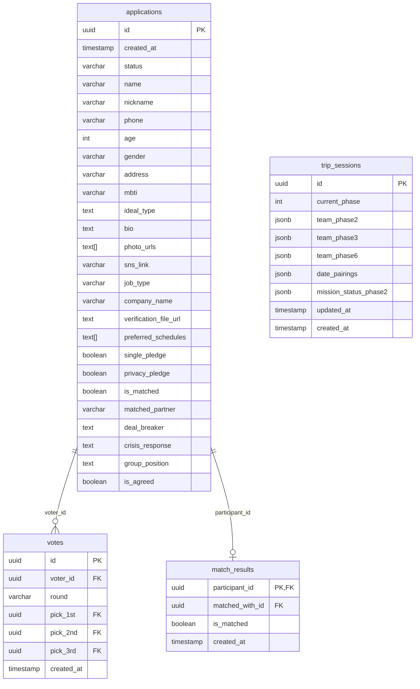

# Signal Trip Master Blueprint & Technical Specification

본 문서는 48시간 오프라인 블라인드 데이트 및 시크릿 미션 여행 이벤트 **'Signal Trip'**의 참가자용 모바일 웹앱 및 호스트용 실시간 관제 어드민(Admin) 시스템의 마스터 블루프린트(바이블)입니다. 프로젝트의 핵심 비즈니스 로직, 기술 아키텍처, 데이터베이스 모델, 그리고 최근 반영된 최신 기능 명세를 포함합니다.

---

## 1. 프로젝트 개요 및 코어 비즈니스 로직

### 1-1. 서비스 정체성
* **Signal Trip**은 참가자들이 제주도에서 48시간 동안 다양한 팀 미션과 소셜 밍글링을 거쳐 최종 커플을 매칭하는 실시간 오프라인 행사 연동 웹 애플리케이션입니다.
* **리얼 미션 여행 예능 컨셉 (피봇 완료)**: 기존의 무겁고 격식 있는 '럭셔리 프라이빗 소개팅' 컨셉에서 피봇하여, 뻔한 게스트하우스 파티나 부담스러운 혼술바 대신 **"나와 취향이 일치하는 운명적인 여행 메이트(취향 크루)를 찾는 리얼 예능 컨셉"**의 시크릿 미션 소셜 여행으로 개편되었습니다.
* 참가자들은 스마트폰 모바일 뷰로 접속하여 정해진 미션과 투표를 진행하며, 주최측(호스트)은 데스크톱 웹 대시보드를 통해 현장 전체 상황을 관제 및 통제합니다.

### 1-2. 핵심 제어 원칙 (하이브리드 페이즈 전환)
* **하이브리드 페이즈 제어**:
  - 기존의 강제 일제 화면 전환 방식에서 탈피하여, 글로벌 DB 페이즈(`globalPhase`)와 참가자의 로컬 화면 뷰 페이즈(`localViewPhase`)를 이중화하여 관리합니다.
  - 호스트가 어드민 대시보드(`PhaseControlTab`)에서 현재 Phase 상태를 Phase 2로 변경해도 참가자 화면이 강제 전환되지 않고, Phase 1 대기실의 `[여행 시작]` 버튼만 활성화됩니다.
  - 참가자가 이 활성화된 버튼을 직접 클릭해야만 브라우저 스토리지(`signal_trip_started = true`)에 시작 상태가 기록되며, 그제서야 `localViewPhase`가 2로 갱신되어 `Phase2TeamMission` 화면이 마운트됩니다.
  - Phase 2 이외의 타 페이즈(Phase 3 ~ 8) 전환 시에는 Supabase Realtime 채널을 통해 즉시 `localViewPhase`와 `globalPhase`가 글로벌 동기화되어 화면이 강제 전환됩니다.
  - **페이즈 롤백(Rollback) 강제 동기화**: 관리자가 부득이하게 페이즈를 뒤로 돌린 경우(`newGlobal < prevLocal`), 참가자 화면도 강제로 이전 페이즈로 동기화(Force Sync)되도록 설계하여 오작동을 방지합니다.

### 1-3. 보안 및 오작동 방어 (Fail-Safe)
* **어드민 접근 제한 (`AdminProtectedRoute`)**:
  - 비밀번호 입력 방식 가드를 구현하여 무단 접속을 차단합니다. 브라우저 세션에 인증 상태를 유지하고, 환경변수 `VITE_ADMIN_PASSWORD` (기본값: `'signal1234'`) 정보로 대조합니다.
  - **어드민 로그아웃**: 사이드바 하단에 안전 로그아웃 기능을 탑재하여, 클릭 시 세션 스토리지(`admin_authenticated`) 값을 지우고 어드민 로그인 페이지로 즉시 강제 이동시킵니다.
* **이중 확인 페이즈 제어**:
  - 호스트가 Phase 변경 버튼을 누를 때 발생할 수 있는 오클릭 사고를 막기 위해 **"이중 확인 모달"**을 노출하여 안전 장치를 제공합니다.
* **노쇼(No-Show) 대비 긴급 봇 인젝션**:
  - 오프라인 당일 불참 인원이 발생해 성비 불균형(남녀 4:4 기본 매칭 구조 붕괴)이 생기면 에러가 날 수 있습니다. 이를 막기 위해 어드민 패널에서 성별을 선택해 **"시그널봇(Dummy Bot)"** 데이터를 `applications` 테이블에 승인 상태(`approved`)로 즉시 인젝션하여 8명 풀을 유지합니다.

---

## 2. 기술 스택 및 환경 변수

### 2-1. 패키지 및 종속성 버전
* **Core Framework**: React `^19.2.6` (TypeScript 환경)
* **Build Tool**: Vite `^8.0.12`
* **Styling**: Tailwind CSS `^4.3.0` (Tailwind Vite Plugin `@tailwindcss/vite` 기반)
* **Database & BaaS Client**: `@supabase/supabase-js` `^2.107.0`
* **Animation**: `framer-motion` `^12.40.0`
* **Icons**: `lucide-react` `^1.17.0`
* **Routing**: `react-router-dom` `^7.17.0`

### 2-2. 환경 변수 구성 (`.env` 규격)
로컬 및 운영 빌드를 위해 프로젝트 루트 디렉토리에 위치해야 하는 환경 변수 파일의 사양입니다.
```bash
# Supabase API 접속 엔드포인트 URL
VITE_SUPABASE_URL=https://ahvwldkwfypugvsuzlto.supabase.co

# Supabase 공개 익명 키
VITE_SUPABASE_ANON_KEY=eyJhbGciOiJIUzI1NiIsInR5cCI6IkpX...

# 어드민 대시보드 진입 비밀번호 (기본값: 'signal1234')
VITE_ADMIN_PASSWORD=signal1234
```

### 2-3. 웹 최적화 및 추적/분석 스크립트 (`index.html` 내장)
* **브라우저 타이틀**: `시그널 트립 | 취향 기반 제주 비밀 여행`
* **메타 설명 (Description)**: "뻔한 게하 파티, 부담스러운 혼술바는 이제 그만. 나와 취향이 완벽히 일치하는 운명적인 여행 메이트를 제주도에서 만나보세요." (오픈그래프 태그에도 동일 적용)
* **Contentsquare UX 트래킹**: 사용자 사용성 개선 및 화면 히트맵 분석을 위해 Contentsquare 분석 스크립트(`https://t.contentsquare.net/uxa/7a6201b13e5e2.js`)를 비동기(`defer`) 로드합니다.
* **Meta Pixel 연동**: 광고 전환율 및 리타겟팅 측정을 위해 Meta Pixel 코드(`ID: 2601360340278561`)가 삽입되었으며, 브라우저 스크립트 차단 환경에 대비해 1x1 이미지 픽셀 `<noscript>` 태그를 백업으로 내장하고 있습니다.

---

## 3. 디렉토리 구조 및 주요 파일의 역할

```
signal-trip/
├── index.html               # 엔트리 HTML (SEO 최적화 메타 태그, Contentsquare, Meta Pixel 내장)
├── src/
│   ├── components/
│   │   ├── Admin/               # 호스트 관제용 서브 컴포넌트 폴더
│   │   │   ├── AdminSidebar.tsx     # 어드민 내비게이션 사이드바 (반응형 대응 및 로그아웃 기능 탑재)
│   │   │   ├── CRMTab.tsx           # 지원자 심사 및 서류 KYC 미디어 뷰어 (버블링 방지, 날짜 필터, 대기 환원 탑재)
│   │   │   ├── PhaseControlTab.tsx  # 페이즈 전환 제어, 타이머 및 Danger Zone 초기화
│   │   │   ├── TeamMixerTab.tsx     # DnD 조 편성 및 1:1 매칭 제어 + 봇 주입
│   │   │   └── VoteViewerTab.tsx    # 투표 집계 리스트 및 SVG 매칭 브릿지 시각화
│   │   ├── Registration/        # 지원서 작성용 서브 컴포넌트 폴더
│   │   │   └── Step3PreInterview.tsx# 취향 매칭 사전 인터뷰 (Q1 ~ Q5 및 모임 포지션 구성)
│   │   ├── WebApp/              # 참가자 전용 웹앱 모바일 뷰 컴포넌트 폴더
│   │   │   ├── WebAppContainer.tsx  # 참가자 메인 컨테이너 (인증, 실시간 페이즈 라우팅, 타임라인 FAB)
│   │   │   ├── mockData.ts          # 클라이언트 Fallback용 Mock 데이터셋 및 타입 정의
│   │   │   ├── Footer.tsx           # 회사 상호 정보 및 법적 고지 공통 하단 푸터 [NEW]
│   │   │   ├── LegalModal.tsx       # 이용약관 및 개인정보처리방침 안내 모달 [NEW]
│   │   │   ├── RuleNoticeModal.tsx  # 시그널 트립 3대 서약 규칙 동의 모달 [NEW]
│   │   │   ├── Phase0Login.tsx      # 참가자 로그인 (닉네임 + 연락처 뒷자리)
│   │   │   ├── Phase1Lobby.tsx      # 웰컴 대기실 및 하이브리드 여행 시작 버튼
│   │   │   ├── Phase2TeamMission.tsx# 1차 팀 미션, 선착순 공유 인증 및 턴제 대화 카드
│   │   │   ├── Phase3DinnerMission.tsx# 디너 밍글링 4인 1조 화면
│   │   │   ├── Phase4FirstVote.tsx  # 1차 호감도 투표 제출 폼
│   │   │   ├── Phase5DateMission.tsx# 1:1 매칭 데이트 가이드라인
│   │   │   ├── Phase6FinalTeam.tsx  # 최종 팀 미션 4인 1조 화면
│   │   │   ├── Phase7FinalChoice.tsx# 최종 1명 선택 폼 제출 모달
│   │   │   └── Phase8Result.tsx     # 최종 커플 성사/위로 발표 화면
│   │   ├── AdminDashboard.tsx   # 어드민 메인 대시보드 뷰어 및 레이아웃 (반응형 그리드)
│   │   ├── HeroSection.tsx      # 예능 컨셉 랜딩 페이지, 아코디언 FAQ 및 요금제 위젯 [UPGRADE]
│   │   ├── RegistrationModal.tsx# 5단계 신청서 작성 모달 (파일 업로드 & 유효성 검증)
│   │   ├── Step1BasicInfo.tsx   # 신청서 Step 1: 기본 인적사항 입력 (자동 하이픈 입력 방어)
│   │   ├── Step2SignalProfile.tsx# 신청서 Step 2: 자기소개, SNS 및 사진 업로드
│   │   ├── Step3JobVerification.tsx# 신청서 Step 4: 직무 선택 및 KYC 증빙서류 업로드
│   │   ├── Step4ScheduleConsent.tsx# 신청서 Step 5: 달력 UI 기반 일정 선택 및 미혼/개인정보 동의 [UPGRADE]
│   │   └── SubmissionSuccess.tsx# 신청서 최종 제출 완료 축하 화면
│   ├── App.tsx                  # 최상위 라우팅 허브 (SPA 라우팅 및 보안 라우터 게이트웨이 탑재)
│   ├── main.tsx                 # 어플리케이션 엔트리 포인트
│   ├── supabaseClient.ts        # Supabase 클라이언트 SDK 초기화 및 타입 선언
│   └── index.css                # 글로벌 테마 및 리셋 스타일 CSS
```

---

## 4. 데이터베이스 스키마 및 상태 관리 (Supabase)

### 4-1. 관계형 스키마 구조



#### 1) `applications` 테이블 (참가자 지원서 및 정보)
* **역할**: 참가자의 가입 정보, 인적사항, 프로필 이미지 URL, 직무 증빙용 KYC 서류 주소, 취향 설문 및 매칭 백업 상태를 저장합니다.
* **주요 컬럼**:
  - `id` (uuid, PK)
  - `status` (varchar, 기본값: `'pending'`): 대기(`pending`), 승인(`approved`), 거절(`rejected`), 이전 기수 보관(`archived`) 중 하나를 가집니다.
  - `gender` (varchar): `MALE` 또는 `FEMALE`
  - `preferred_schedules` (text[]): 참가자가 선택한 희망 일정 배열. 신청서 Step 5 캘린더 UI에서 단일 선택한 날짜 포맷(`['YYYY-MM-DD']`) 또는 무관하게 조율하겠다는 뜻의 `['flexible']` 값이 저장됩니다.
  - `photo_urls` (text[]): Supabase `profile_photos` 버킷에 업로드된 참가자 프로필 사진 URL 목록
  - `verification_file_url` (text): Supabase `verification_docs` 버킷에 업로드된 KYC 신원/직무 증빙 서류 URL
  - `deal_breaker` (text): 취향 매칭 설문 3단계 질문 데이터의 결합 필드 (`"Q1: [Q1 답변] / Q4 지뢰: [Q4 답변]"`)
  - `crisis_response` (text): 취향 매칭 설문 3단계 질문 데이터의 결합 필드 (`"Q2: [Q2 답변] / Q5 소울: [Q5 답변]"`)
  - `group_position` (text): 취향 매칭 설문 3단계 질문 데이터의 결합 필드 (`"포지션: [포지션 답변] / Q3: [Q3 답변]"`)
  - `is_matched` / `matched_partner` (boolean / varchar): 기수 데이터 하드 리셋 시 이전 기수 매칭 성공 여부 및 상대 닉네임을 아카이빙하기 위한 백업용 필드
  - `is_agreed` (boolean, 기본값: `false`): 서비스 이용 규칙 및 개인정보 보호 서약 확인 여부 (웹앱 최초 진입 가드 플래그)

#### 2) `trip_sessions` 테이블 (글로벌 48시간 라이브 세션 상태)
* **역할**: 현재 실시간 진행 중인 Phase 정보와 각 Phase별 팀(조) 편성 및 팀 공유 상태 데이터를 보관합니다.
* **주요 컬럼**:
  - `id` (uuid, PK)
  - `current_phase` (int, 기본값: `1`): `1`부터 `8`까지의 글로벌 상태 값.
  - `team_phase2` / `team_phase3` / `team_phase6` (jsonb): 각 페이즈별 조 편성 정보 (`{ "team_a": [id1, id2...], "team_b": [id3, id4...] }`)
  - `date_pairings` (jsonb): 1:1 매칭 커플 정보 (`{ "maleId": "femaleId" }`)
  - `mission_status_phase2` (jsonb, 기본값: `{}`): A/B팀별 사진 미션 인증 완료 상태 기록 컬럼 (`{ "team_a": "인증자닉네임", "team_b": null }`)
  - `updated_at` (timestamp): 실시간 타이머 계산 기준일시.

#### 3) `votes` 테이블 (1차 및 최종 투표 기록)
* **역할**: 참가자가 Phase 4 및 Phase 7에서 제출한 이성 선택표를 기록합니다.
* **주요 컬럼**:
  - `id` (uuid, PK)
  - `voter_id` (uuid, FK ➔ `applications.id`): 투표를 한 참가자.
  - `round` (varchar): 1차 투표 (`first`) 또는 최종 투표 (`final`).
  - `pick_1st` (uuid, FK ➔ `applications.id`): 1순위 선택 이성.
  - `pick_2nd` / `pick_3rd` (uuid, FK, Nullable): 2순위, 3순위 선택 이성.

#### 4) `match_results` 테이블 (최종 매칭 결과 저장소)
* **역할**: Phase 8 공개 준비 단계에서 호스트가 확정한 최종 결과를 저장합니다.
* **주요 컬럼**:
  - `participant_id` (uuid, PK, FK ➔ `applications.id`): 해당 참가자.
  - `matched_with_id` (uuid, FK ➔ `applications.id`, Nullable): 매칭 성사된 상대방 ID. (매칭 실패 시 `null`)
  - `is_matched` (boolean): 매칭 성공 여부. (성비 8명 전원의 상태를 일괄 upsert 해야 함)

---

## 5. UI/UX Flow 및 세부 기능 명세

### 5-1. 서비스 소개 랜딩 페이지 및 지원서 등록 폼 (Landing & Registration)
* **메인 랜딩 페이지 (`HeroSection.tsx`)**:
  - 제주에서의 미션 소셜 여행의 컨셉과 가이드 소개.
  - **[배경 슬라이더] (신규 추가)**: 랜딩페이지 최상단 Hero 섹션 배경에 두 장의 이미지(`/images/hero-bright.png` 밝은 라운지, `/images/hero-dark.png` 어두운 노을)가 5.5초 간격으로 부드럽게 Fade in/out 교차하는 백그라운드 슬라이더를 도입했습니다. 텍스트 가독성을 극대화하기 위해 암막 오버레이 및 점진적 블랙 그라데이션(`bg-gradient-to-b from-black/30 to-black/70`) 가드가 이중 적재되어 있습니다.
  - **[페르소나 섹션] (신규 추가)**: 아주 옅은 크림색(`bg-stone-50`) 배경 위에 시끄러운 게하 파티에 지치거나 결이 맞는 동행을 원하고, 소규모 깊은 대화를 선호하며, 로맨틱한 우연을 꿈꾸는 4가지 타겟 페르소나 리스트를 체크 아이콘(✅)을 곁들여 깔끔하게 정렬했습니다.
  - **[상세 여정 (Cinematic Journey) 섹션] (신규 추가)**: "시그널 트립, 이렇게 영화가 시작됩니다"라는 타이틀과 함께 나의 여행 취향 기록하기(D-3, `/images/scene1_taste.png`), 운명적인 시크릿 초대장 도착(D-1, `/images/scene2_invitation.png`), 우연을 가장한 타이밍의 만남(D-Day, `/images/serendipity.png`), 취향 담긴 프라이빗 F&B 대화(만남 이후, `/images/scene4_fnb.png`)의 4단 Scene 스토리를 고해상도 이미지와 함께 교차(Zig-zag) 형태로 배치했습니다.
  - **[진행 방법 (How It Works) 섹션] (신규 추가)**: "시그널 트립, 이렇게 진행됩니다"라는 타이틀과 함께 위에서 아래로 정렬되는 직관적인 세로형(Vertical) 레이아웃을 제공합니다. 기존 가로 배열 대신 시그니처 초록색 라인 일러스트 아이콘들(step1-clipboard, step2-unlock, step3-qr, step4-ticket)을 큼직한 원형 프레임 안에 담아 배치했으며, 기존의 지저분한 회색 보충설명 박스들을 모두 제거하여 가독성을 높였습니다. 텍스트는 안내에 적합하도록 친절하고 부드러운 톤앤매너로 서술되었습니다.
  - **[가상 프로필(미리보기) 섹션] (신규 추가)**: `[How It Works]`와 `[Trust & Safety]` 섹션 사이에 배치되며, 옅고 따뜻한 웜그레이/크림색(`bg-stone-50`) 배경 위에 "당신이 만나게 될지도 모르는 누군가"라는 타이틀과 함께 엄격한 취향 심사를 통과한 3명의 가상 프로필 카드를 제공합니다. 데스크톱에서는 3열 그리드, 모바일에서는 좌우 스크롤(Swipe) 형태로 구현되었으며 얼굴 사진 없이 미니멀한 텍스트와 성향 태그(포인트 컬러 `#00C7B5` 적용) 및 감성적인 한 줄 인터뷰로 디자인되었습니다.
  - **[신뢰와 안전 (Trust & Safety) 섹션] (신규 추가)**: 차분한 어두운 톤(`bg-zinc-900`) 배경에 깐깐한 취향 심사(방패 🛡️), 신원 검증 프로세스(자물쇠 🔒), 3대 클린 서약(문서 📜)으로 이어지는 3대 안전 장치를 미니멀한 카드 스타일로 나열하여 압도적인 신뢰감을 제공합니다.
  - **Floating CTA 버튼**: 기존 대비 30% 콤팩트하게 축소하여 가독성을 높였으며, 버튼 텍스트는 **"시그널 트립 무료로 탑승하기"**로 개편하고 하단에 결제 안심 문구를 기재했습니다.
  - **참가비 안내 위젯**: 1인 참가비가 **35,000원**으로 표시되며, 그 바로 하단 및 Sticky CTA 하단에 `* 초기 신청 및 심사는 100% 무료이며, 매칭 성사 시에만 참가비(35,000원) 결제가 진행됩니다.` 안심 안내 문구가 명시되어 있습니다.
  - **FAQ 아코디언**: 참가자들이 가장 자주 묻는 질문들을 접고 펼칠 수 있는 아코디언 컴포넌트를 추가하였으며, 부드러운 애니메이션 효과가 적용되어 있습니다.
  - **푸터 및 법적 규격 연동**: 조용한 성장 사업자 정보 및 연락망 정보가 기재된 `Footer`와 상용 서비스 규격의 `LegalModal`을 탑재하여 신뢰성을 강화하였습니다.

* **5단계 신청서 프로세스 (`RegistrationModal.tsx`)**:
  1. **1단계: 기본인증 (`Step1BasicInfo.tsx`)**: 본명, 닉네임, 연락처(10~11자리, 입력 시 자동 하이픈 및 문자 제거 방어 적용), 나이(만 19세 이상 가드), 성별, 거주지, MBTI 형식 검사.
  2. **2단계: 프로필 (`Step2SignalProfile.tsx`)**: 나의 여행 스타일, 자기소개 글쓰기, 프로필 사진 업로드, SNS 계정 링크 필수 입력.
  3. **3단계: 인터뷰 (`Step3PreInterview.tsx`)**: 성향 및 미식 취향 매칭용 사전 질문이 5가지 질문(Q1~Q5)으로 정제되었습니다.
     - 제주 오후 2시 선호 공간(Q1), 메이트와 나누고 싶은 대화의 온도(Q2), 첫 만남 후 저녁 식사 장소(Q3), 기피 식재료/지뢰 음식(Q4 - 서술형), 제주에서 경험하고 싶은 식사/술 소울푸드(Q5 - 서술형).
     - 데이터베이스에는 `deal_breaker`, `crisis_response`, `group_position` 세 개 필드에 각 질문 답변이 아래와 같이 저장됩니다:
       - `deal_breaker`: `"Q1: ${step3Data.q1} / Q4 지뢰: ${step3Data.q4}"`
       - `crisis_response`: `"Q2: ${step3Data.q2} / Q5 소울: ${step3Data.q5}"`
       - `group_position`: `"Q3: ${step3Data.q3}"`
  4. **4단계: 신원인증 (`Step3JobVerification.tsx`)**: 직무 유형 선택, 직장/상호명 입력, 신원 및 재직 KYC 증빙서류 업로드. 가장 안전하고 프라이빗한 만남을 위한다는 우아한 헤더 초대글 및 서류 암호화 첨부 알림, 서류 검토 후 즉시 영구 파기 서약 가이드 등 개인정보 보호 강화 문구를 탑재했습니다.
  5. **5단계: 서약완료 (`Step4ScheduleConsent.tsx`)**:
     - 기존의 단순 리스트 형태에서 탈피하여 **달력(Calendar) UI**를 새롭게 적용했습니다.
     - 참가 희망 날짜를 달력에서 **단일 선택(YYYY-MM-DD 포맷)**하거나, 일정에 구애받지 않고 유연하게 매칭되기를 원할 경우 **"제주 여행 예정 - 일정 조율" (`flexible`)** 체크박스를 활성화할 수 있습니다.
     - 일정 제출 완료 후의 변경 문의를 위한 관리자 메일 가이드(`noteband@naver.com`)가 명시되어 있습니다.
     - 미혼 서약 동의 및 개인정보 동의.

---

### 5-2. 참가자 웹앱 (Phase 0 ~ Phase 8)
모바일 브라우저에 최적화된 모바일 전용 컨테이너(`max-w-md mx-auto`) 형태로 구현되어 있습니다.

* **온보딩 규칙 가드 (`RuleNoticeModal.tsx`)**:
  - 참가자가 로그인하여 웹앱에 처음 진입할 때, 시그널 트립 3대 핵심 규칙(익명성 보장, 거절 의사 존중, 전 일정 사진 무단 촬영 금지 및 비밀 유지)이 담긴 서약 모달이 노출됩니다.
  - 사용자는 하단 `[확인하고 입장하기]` 버튼을 직접 눌러야만 로비 화면에 진입할 수 있으며, 이 동의 결과는 `is_agreed` 상태값으로 보존됩니다.

* **Phase 0 (인증 - `Phase0Login.tsx`)**: 닉네임 + 연락처 뒷 4자리를 `applications` 테이블에서 조회하여 승인 상태 확인 후 로컬 스토리지에 세션 보존.
* **Phase 1 (대기실 - `Phase1Lobby.tsx`)**: 애니메이션으로 환영 편지를 보여주며 긴장감 조성. `globalPhase === 2` 상태가 충족되면 활성화 민트색 그라데이션 및 박동 애니메이션이 들어간 `[여행 시작]` 버튼이 열리며, 클릭 시 브라우저 세션(`signal_trip_started = true`)을 갱신하고 Phase 2 미션 페이지로 진입 가능.
* **Phase 2 (1차 팀 미션 - 4인 1조 - `Phase2TeamMission.tsx`)**:
  - **선착순 팀 공유 인증 (Shared State Photo verification)**:
    - 상단 행동 미션 영역에 `[📸 1단계: 사진 인증 업로드]` 카드가 활성화됩니다.
    - 내 ID가 속한 팀(`team_a`/`team_b`)의 완료 여부를 `sessionData.mission_status_phase2` 에서 감지하여, 미인증 시에는 1.5초 시뮬레이션 업로드 후 DB를 갱신합니다.
    - 팀원 4명 중 누군가가 인증을 마치면 즉시 Realtime으로 다른 팀원들의 화면도 동기화되어 업로드 영역이 **민트색 글로우 네온 카드**로 변하고, 버튼이 비활성화되며 `✅ 미션 완료 ([인증자] 님이 인증함)` 배지가 노출됩니다.
  - **대화 카드 오프라인 턴제 모드 (동적 셔플링)**:
    - 조원 전체(나 포함 4명)의 닉네임 목록을 추출하고, [대화 카드 뽑기]를 누를 때마다 4인 배열을 무작위 셔플합니다.
    - 중복 없이 첫 번째를 질문자(`asker`), 두 번째를 답변자(`answerer`)로 지정하여 액션 지시 문구(`🗣️ [질문자]가 👉 [답변자]에게...`)와 함께 질문 내용을 AnimatePresence 페이드 트랜지션으로 렌더링합니다.
* **Phase 3 (디너 밍글링 - `Phase3DinnerMission.tsx`)**: 새로운 조 편성 공개 및 "시크릿 디너 및 바이닐(Vinyl) 밍글링" 가이드라인 연동.
* **Phase 4 (1차 투표 - `Phase4FirstVote.tsx`)**: 이성 후보 중 1~3순위를 골라 `votes(round='first')` 테이블에 저장.
* **Phase 5 (1:1 매칭 데이트 - `Phase5DateMission.tsx`)**: 호스트가 확정한 데이트 가이드에 따라 미션 수행.
* **Phase 6 (최종 바비큐 미션 - `Phase6FinalTeam.tsx`)**: 최종 4인 1조 밍글링.
* **Phase 7 (최종 선택 - `Phase7FinalChoice.tsx`)**: 최종 1순위 이성 결정 투표 및 `votes(round='final')` 전송.
* **Phase 8 (최종 결과 - `Phase8Result.tsx`)**: `match_results`를 조회하여 `is_matched === true`이면 축하 confetti 애니메이션과 함께 매칭 상대의 실명/연락처가 표시되며, `is_matched === false`이면 위로 카드를 출력합니다.

#### *점진적 타임라인(Bottom Sheet) 블러 필터 및 펄스 효과*
* 화면 하단 캘린더 플로팅 버튼(FAB) 클릭 시 아래에서 위로 스와이프 업 되는 시트 레이아웃입니다.
* `localViewPhase` 기준으로 아래 세 가지 상태로 UI를 다르게 구분합니다.
  1. **과거 (`phase < localViewPhase`)**: 불투명도를 `0.4`로 조정한 뒤 `CheckCircle2` 아이콘 표시.
  2. **현재 (`phase === localViewPhase`)**: 선명하게 강조하며, framer-motion으로 크기가 박동하는 초록 펄스 배지(`🟢 진행 중`) 표시.
  3. **미래 (`phase > localViewPhase`)**: 스포일러 방지를 위해 텍스트 타이틀에 CSS 블러 효과(`filter: 'blur(5px)'`)를 입히고 자물쇠(`Lock`) 아이콘 표시.

---

### 5-3. 관리자 어드민 (Admin Dashboard)

#### 1) 모바일 관제 대응 및 로그아웃 기능
* **반응형 대시보드 레이아웃**:
  - 어드민 페이지 전체에 모바일/태블릿 가독성을 위해 `flex-col md:flex-row` 구조 및 `overflow-x-auto w-full` 스타일을 입혔습니다.
  - 가로 폭이 부족한 모바일 화면에서는 사이드바가 상단 가로바 내비게이션으로 자연스럽게 축소 전환되며, 텍스트 상세 설명(`desc`)은 숨김(`hidden md:block`) 처리됩니다.
  - 사이드바 하단에는 **"로그아웃"** 버튼을 배치해 즉각적인 세션 만료 및 로그인 화면으로의 전환을 가능하게 하였습니다.

#### 2) `CRMTab` (참가자 심사/관리)
* **Row-Click KYC 미디어 뷰어**:
  - 리스트 행(`<tr>`) 전체에 클릭 리스너를 바인딩하여 행 클릭 시 KYC 증빙 서류 뷰어가 뜨도록 구현했습니다.
  - 리스트 내부의 액션 버튼(상세, 승인, 거절 등)에 `e.stopPropagation()`을 주어 버블링에 의한 모달 중복 오픈 오작동을 완전히 차단합니다.
* **상시 결과 갱신 및 대기 환원**:
  - 승인 상태와 무관하게 [승인], [거절] 버튼을 항상 노출시키고, 승인/거절 완료 시에는 완료 스타일과 비활성화를 처리합니다.
  - **대기로 돌리기 액션**: 심사가 이미 끝난(승인/거절) 신청자 카드를 다시 심사 중 대기 상태(`pending`)로 되돌릴 수 있는 롤백 프로세스를 지원합니다.
* **참가일정 필터 고정화**:
  - 달력 UI 개편에 발맞추어 신청 날짜를 하드코딩된 선택지 목록(7월 3일 ~ 7월 6일 금/토/일/월 개별 날짜 및 `flexible` 일정 조율)으로 필터 드롭다운을 일원화하여, 호스트가 참가 일정을 직관적으로 필터링하도록 도왔습니다.

#### 3) `TeamMixerTab` (DnD 조 편성 및 봇 주입)
* **더미 봇 주입**: 성별을 지정해 인젝트 버튼을 누르면 `닉네임: '시그널봇[임의숫자]'`, `status='approved'` 데이터가 applications DB에 즉시 삽입되어 refetch 됩니다.
* **HTML5 native DnD Kanban Board**:
  - `draggable="true"` 속성과 `onDragStart`, `onDragOver`, `onDrop` 이벤트를 이용해 무배정 풀, 팀 A, 팀 B 간에 참가자 카드를 끌어서 옮겨 조를 동적으로 재배치할 수 있습니다.
  - 수동 드래그 앤 드롭 시 타겟 컬럼에 최대 4명까지 안전하게 배정될 수 있도록 검사 조건을 제공하며, 4:4 배정이 원활하게 이루어집니다.
  - Phase 5의 1:1 데이트 스왑 매칭 또한 드래그 앤 드롭으로 여성 파트너를 다른 남성 카드 영역으로 끌고 가 스왑(파트너 맞바꾸기)할 수 있습니다.

#### 4) `PhaseControlTab` (페이즈 제어 및 데이터 초기화)
* **이중 잠금 팝업**: 페이즈 업데이트 전에 확인 창을 띄워 관리 실수에 따른 진행 엉킴을 미연에 방지합니다.
* **실시간 타이머**: `session.updated_at` 시간으로부터 경과된 시간을 초 단위로 누적 연산하여 현재 페이즈 진행률을 실시간으로 호스트 화면 헤더에 보여줍니다.
* **실시간 연결 참가자 관제**: 실시간 세션 연동 및 접속자 현황(`연결 참가자: 8 / 8명`)을 표시하여 행사 참가자들의 연결 안정성 검수.
* **Danger Zone (전체 행사 데이터 초기화)**:
  - 새로운 기수의 행사를 개시하기 위해 기존 기수 참가자 상태를 일괄 아카이빙(`status = 'archived'`) 처리.
  - 아카이빙 전 최종 `match_results` 데이터를 기반으로 각 참가자의 `is_matched` 및 `matched_partner` 필드에 매칭 파트너 닉네임을 백업 기록.
  - `votes`, `match_results` 테이블의 데이터를 영구 삭제하고 글로벌 세션 페이즈를 Phase 1로 리셋.

#### 5) `VoteViewerTab` (투표 분석 및 매칭 브릿지)
* **1차 투표 뷰 테이블화**: 1차 호감도 선택(Phase 4) 데이터를 테이블 형태로 렌더링하여 운영진 참고용 지목 목록을 출력합니다.
* **SVG 매칭 브릿지 시각화**:
  - 남성과 여성의 프로필 카드 노드의 실시간 중심 좌표 `x, y`를 계산하여 두 노드 간 지목 연결선(`<line>`)을 SVG 레이어 위에 직접 렌더링합니다.
  - **상호 지목 (Mutual Match)**: 남녀가 서로를 1순위로 지목한 경우, 라인을 굵은 핑크색(`stroke="#ec4899"`, `strokeWidth={4}`)으로 두껍게 렌더링하여 최종 커플 여부를 직관적으로 보여줍니다.
* **탈락자 포함 8명 전원 일괄 Upsert**:
  - [최종 매칭 결과 DB 확정하기] 클릭 시, 커플 성사자와 매칭에 실패한 탈락자(8인 전원)를 매핑하여 `matched_with_id: null` / `is_matched: false` 또는 `matched_with_id: partner_id` / `is_matched: true` 레코드를 생성하여 한 번의 트랜잭션(`upsert`)으로 Supabase DB에 밀어 넣어 Phase 8의 참가자 화면 오류를 방어합니다.

---

## 6. 유지보수 및 인수인계 가이드
1. **신규 페이즈 추가 시**:
   - `trip_sessions`의 `current_phase` 값을 감안하여 `WebAppContainer.tsx`의 `renderPhase` 분기에 매칭할 컴포넌트를 정의하고 추가합니다.
   - `TIMELINE_DATA` 데이터셋에 신규 Phase의 스케줄 타이틀과 시간을 삽입합니다.
2. **매칭 로직 수정 시**:
   - `VoteViewerTab.tsx`의 `finalMatches` `useMemo` 블록에서 남녀 1순위 지목 대조 로직 및 `upsert` 데이터 매핑 레이아웃을 검토하여 수정합니다.
3. **타입 린트 체크**:
   - 코드를 수정한 뒤에는 배포 전 반드시 `npm run build`를 수행해 TypeScript 경고 및 미사용 임포트(`TS6133`) 유무를 완벽히 통과시켜야 합니다.
