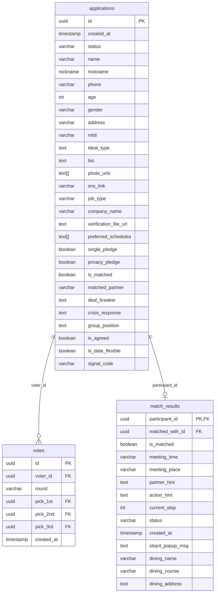

# Signal Trip Master Blueprint & Technical Specification

본 문서는 1:1 매칭 및 시크릿 미션 여행 이벤트 **'Signal Trip'**의 참가자용 모바일 웹앱 및 호스트용 실시간 관제 어드민(Admin) 시스템의 마스터 블루프린트(바이블)입니다. 프로젝트의 핵심 비즈니스 로직, 기술 아키텍처, 데이터베이스 모델, 그리고 최근 반영된 V2 스텝 및 1:1 매칭 기능 명세를 포함합니다.

---

## 1. 프로젝트 개요 및 코어 비즈니스 로직

### 1-1. 서비스 정체성
* **Signal Trip**은 참가자들이 제주도에서 여행 취향과 일정을 기반으로 1:1 매칭을 맺고, 시크릿 미션을 수행하며 서로를 찾아가는 온·오프라인 하이브리드 소셜 매칭 웹 애플리케이션입니다.
* **1:1 취향 매칭 & 시크릿 미션 컨셉 (V2 개편 완료)**: 기존의 다대다(4:4) 일제 페이즈 전환 방식에서 피봇하여, **"나와 취향 및 일정이 일치하는 운명적인 여행 메이트를 1:1로 매칭하고 단계별 미션을 통해 서로를 탐색하는 프라이빗 여정"**으로 개편되었습니다.
* 참가자는 모바일 브라우저를 통해 본인의 스텝(Step 1 ~ 4)에 맞추어 개별적으로 미션을 수행하며, 호스트는 데스크톱 어드민 대시보드를 통해 매칭 생성, 상세 미션 내용 조율, 스텝 수동 제어 등을 수행합니다.
* **라이트 웜베이지 감성 테마 피봇 (최신 개편)**: 전체 서비스 테마가 기존의 어두운 다크 톤(Legacy)에서 **따뜻하고 편안한 밝은 웜베이지 톤(Light Warm Beige)**으로 전면 피봇되었습니다. 모바일 웹앱과 랜딩 페이지 전체에 걸쳐 배경색 `#FAF8F5`, 주 텍스트 색상 `#1C1917` (stone-900), 포인트 브랜드 색상 `#00C7B5` (민트/티안)를 일관되게 활용하여 신뢰감 있고 부드러운 분위기를 형성합니다.


### 1-2. V2 비동기 스텝 전환 제어 (Asynchronous Step Transition)
* **개별 스텝 기반 여정**:
  - 일제히 모든 참가자의 화면을 강제 전환하는 글로벌 Phase 방식 대신, 커플별/참가자별로 독립적인 스텝 상태(`match_results.current_step`)를 기반으로 여정이 전개됩니다.
  - 참가자가 모바일 웹앱에서 특정 행동(예: 입금 완료, 장소 도착, 보물찾기 시작)을 완료하면 자신의 `current_step`이 데이터베이스에 업데이트되고, Supabase Realtime 채널을 통해 화면이 즉각적으로 전환됩니다.
  - **스텝 독립성**: 커플 매칭이 되더라도 Step 1 ~ 3까지는 각자 개별적으로 인증을 하거나 도착을 확인해야 다음 단계로 진입할 수 있도록 설계되어 두 참가자 간의 행동 차이를 완충합니다.

### 1-3. 보안 및 오작동 방어 (Fail-Safe)
* **어드민 접근 제한 (`AdminProtectedRoute`)**:
  - 비밀번호 입력 방식 가드를 구현하여 무단 접속을 차단합니다. 브라우저 세션에 인증 상태를 유지하고, 환경변수 `VITE_ADMIN_PASSWORD` (기본값: `'signal1234'`) 정보로 대조합니다.
* **어드민 로그아웃**: 어드민 사이드바 하단에 안전 로그아웃 기능을 탑재하여 세션 스토리지(`admin_authenticated`) 값을 지우고 어드민 로그인 페이지로 즉시 강제 이동시킵니다.
* **수동 스텝 및 파트너 조율**:
  - 어드민의 `1:1 매칭 & 미션 (V2)` 탭(`CouplesTab`)을 통해 관리자는 매칭 성사, 데이트 일정 조율, 스텝 변경 등을 제어할 수 있으며, 잘못 매칭된 커플을 분리(Unmatch)하여 다시 대기 풀로 안전하게 돌려놓는 기능(롤백 방지 가드 탑재)을 지원합니다.
* **KYC 개인정보 보호 강화**:
  - 참가자 신원 및 재직 KYC 증빙서류는 심사 목적 달성 후 관리자 판단에 따라 파기/보관 처리할 수 있도록 동선이 구축되어 있습니다.

---

## 2. 기술 스택 및 환경 변수

### 2-1. 패키지 및 종속성 버전
* **Core Framework**: React `^19.2.6` (TypeScript 환경)
* **Build Tool**: Vite `^8.0.12`
* **Styling**: Tailwind CSS `^4.3.0` (Tailwind Vite Plugin `@tailwindcss/vite` 기반)
  - **디자인 테마 사양**: 따뜻한 웜베이지 테마(`bg-[#FAF8F5]`, `text-[#1C1917]`) 및 민트 포인트 컬러(`#00C7B5`)를 표준 토큰으로 관리합니다.
  - **스크롤바 숨김 유틸**: 모바일 뷰 최적화를 위해 브라우저 스크롤바를 숨기는 커스텀 유틸 클래스(`.scrollbar-none`)가 `index.css`에 추가 반영되었습니다.
* **Database & BaaS Client**: `@supabase/supabase-js` `^2.107.0`
* **Animation**: `framer-motion` `^12.40.0`
* **Icons**: `lucide-react` `^1.17.0`
* **Routing**: `react-router-dom` `^7.17.0`

### 2-2. 환경 변수 구성 (`.env` 규격)
로컬 및 운영 빌드를 위해 프로젝트 루트 디렉토리에 위치해야 하는 환경 변수 파일의 사양입니다.
```bash
# Supabase API 접속 엔드포인트 URL
VITE_SUPABASE_URL=https://ahvwldkwfypugvsuzlto.supabase.co

# Supabase 공개 익명 키
VITE_SUPABASE_ANON_KEY=eyJhbGciOiJIUzI1NiIsInR5cCI6IkpX...

# 어드민 대시보드 진입 비밀번호 (기본값: 'signal1234')
VITE_ADMIN_PASSWORD=signal1234
```

### 2-3. 웹 최적화 및 추적/분석 스크립트 (`index.html` 내장)
* **브라우저 타이틀**: `시그널 트립 | 취향 기반 제주 비밀 여행`
* **메타 설명 (Description)**: "뻔한 게하 파티, 부담스러운 혼술바는 이제 그만. 나와 취향이 완벽히 일치하는 운명적인 여행 메이트를 제주도에서 만나보세요." (오픈그래프 태그에도 동일 적용)
* **Contentsquare UX 트래킹**: 사용자 사용성 개선 및 화면 히트맵 분석을 위해 Contentsquare 분석 스크립트(`https://t.contentsquare.net/uxa/7a6201b13e5e2.js`)를 비동기(`defer`) 로드합니다.
* **Meta Pixel 연동**: 광고 전환율 및 리타겟팅 측정을 위해 Meta Pixel 코드(`ID: 2601360340278561`)가 삽입되었으며, 브라우저 스크립트 차단 환경에 대비해 1x1 이미지 픽셀 `<noscript>` 태그를 백업으로 내장하고 있습니다.

---

## 3. 디렉토리 구조 및 주요 파일의 역할

```
signal-trip/
├── index.html               # 엔트리 HTML (SEO 최적화 메타 태그, Contentsquare, Meta Pixel 내장)
├── src/
│   ├── components/
│   │   ├── Admin/               # 호스트 관제용 서브 컴포넌트 폴더
│   │   │   ├── AdminSidebar.tsx     # 어드민 내비게이션 사이드바 (반응형 대응, 로그아웃, 3대 탭 전환)
│   │   │   ├── CRMTab.tsx           # 지원자 심사 및 서류 KYC 미디어 뷰어 (버블링 방지, 날짜 필터, 대기 환원)
│   │   │   ├── CouplesTab.tsx       # [V2 핵심] 1:1 매칭 커플 관리 및 시크릿 미션 세부사항(시간/장소/힌트) 수동 조율
│   │   │   ├── VoteViewerTab.tsx    # 투표 집계 리스트 및 SVG 매칭 브릿지 시각화
│   │   │   ├── PhaseControlTab.tsx  # [LEGACY/INACTIVE] 구버전 글로벌 페이즈 전환 제어 탭
│   │   │   └── TeamMixerTab.tsx     # [LEGACY/INACTIVE] 구버전 DnD 조 편성 및 봇 주입 탭
│   │   ├── Registration/        # 지원서 작성용 서브 컴포넌트 폴더
│   │   │   └── Step3PreInterview.tsx# 취향 매칭 사전 인터뷰 (Q1 ~ Q5 구성)
│   │   ├── WebApp/              # 참가자 전용 웹앱 모바일 뷰 컴포넌트 폴더
│   │   │   ├── WebAppContainer.tsx  # [V2 핵심] 참가자 메인 컨테이너 (인증, 실시간 스텝 전환, Step 1 ~ 4 뷰 렌더러)
│   │   │   ├── mockData.ts          # V2 타입 정의 및 클라이언트 Fallback용 Mock 데이터셋
│   │   │   ├── Footer.tsx           # 회사 상호 정보 및 법적 고지 공통 하단 푸터
│   │   │   ├── LegalModal.tsx       # 이용약관 및 개인정보처리방침 안내 모달
│   │   │   ├── RuleNoticeModal.tsx  # [LEGACY/INACTIVE] 구버전 시그널 트립 3대 서약 규칙 동의 모달 (바이패스됨)
│   │   │   ├── Phase0Login.tsx      # 참가자 로그인 (닉네임 + 연락처 뒷자리)
│   │   │   └── Phase1Lobby.tsx ~ Phase8Result.tsx # [LEGACY/INACTIVE] 구버전 8페이즈 개별 뷰 컴포넌트들
│   │   ├── AdminDashboard.tsx   # 어드민 메인 대시보드 뷰어 및 레이아웃 (반응형 그리드)
│   │   ├── HeroSection.tsx      # 예능 컨셉 랜딩 페이지, 아코디언 FAQ 및 요금제 위젯
│   │   ├── RegistrationModal.tsx# 5단계 신청서 작성 모달 (파일 업로드 & 유효성 검증)
│   │   ├── Step1BasicInfo.tsx   # 신청서 Step 1: 기본 인적사항 입력 (자동 하이픈 입력 방어)
│   │   ├── Step2SignalProfile.tsx# 신청서 Step 2: 자기소개, SNS 및 사진 업로드
│   │   ├── Step3JobVerification.tsx# 신청서 Step 4: 직무 선택 및 KYC 증빙서류 업로드
│   │   ├── Step4ScheduleConsent.tsx# 신청서 Step 5: 달력 UI 기반 일정 선택, 일정 조율 및 동의서
│   │   └── SubmissionSuccess.tsx# 신청서 최종 제출 완료 축하 화면
│   ├── App.tsx                  # 최상위 라우팅 허브 (SPA 라우팅 및 보안 라우터 게이트웨이 탑재)
│   ├── main.tsx                 # 어플리케이션 엔트리 포인트
│   ├── supabaseClient.ts        # Supabase 클라이언트 SDK 초기화 및 Application 데이터 규격 선언
│   └── index.css                # 글로벌 테마 및 리셋 스타일 CSS
```

---

## 4. 데이터베이스 스키마 및 상태 관리 (Supabase)

### 4-1. 관계형 스키마 구조 (V2 개편 반영)



#### 1) `applications` 테이블 (참가자 지원서 및 정보)
* **역할**: 참가자의 가입 정보, 인적사항, 프로필 이미지 URL, 직무 증빙용 KYC 서류 주소, 취향 설문 및 일정 선호 상태를 저장합니다.
* **주요 컬럼**:
  - `id` (uuid, PK)
  - `status` (varchar, 기본값: `'pending'`): 대기(`pending`), 승인(`approved`), 거절(`rejected`), 이전 기수 보관(`archived`) 중 하나를 가집니다.
  - `gender` (varchar): `MALE` 또는 `FEMALE`
  - `preferred_schedules` (text[]): 참가자가 선택한 희망 일정 배열. 신청서 Step 5 캘린더 UI에서 단일 선택한 날짜 포맷(`['YYYY-MM-DD']`)이 저장됩니다.
  - `is_date_flexible` (boolean, 기본값: `false`): 일정 조율 동의 여부. 활성화 시 `is_date_flexible = true`가 반영되며, 선택한 날짜 외에도 매칭될 의향이 있음을 표명합니다.
  - `photo_urls` (text[]): Supabase `profile_photos` 버킷에 업로드된 참가자 프로필 사진 URL 목록
  - `verification_file_url` (text): Supabase `verification_docs` 버킷에 업로드된 KYC 신원/직무 증빙 서류 URL
  - `deal_breaker` / `crisis_response` / `group_position` (text): 취향 매칭 설문 3단계 질문 데이터의 결합 필드.
  - `is_agreed` (boolean, 기본값: `false`): 서비스 이용 규칙 및 개인정보 보호 서약 확인 여부 (웹앱 최초 진입 가드 플래그).
  - `signal_code` (varchar(4)): 가입 제출 시 임의 생성되는 참가자의 고유 4자리 시그널 인증 코드. 만남 현장(Step 3)에서 교환하여 검증할 때 활용됩니다.

#### 2) `match_results` 테이블 (1:1 매칭 커플 정보 및 진행 상황 - V2 핵심)
* **역할**: 매칭에 성공한 참가자 간의 1:1 관계와 실시간 미션 가이드 및 개별 스텝 상태를 보관합니다.
* **주요 컬럼**:
  - `participant_id` (uuid, PK, FK ➔ `applications.id`): 해당 참가자.
  - `matched_with_id` (uuid, FK ➔ `applications.id`, Nullable): 매칭 성사된 상대방 ID. (매칭 실패 시 `null`)
  - `is_matched` (boolean): 매칭 성공 여부.
  - `meeting_time` (varchar/text, Nullable): 매칭 확정 후 지정되는 만남 일시 정보 (예: `7월 4일 (토) 오후 2시`).
  - `meeting_place` (varchar/text, Nullable): 만남을 가질 약속 장소 (예: `제주 애월 아쿠아 디너`).
  - `partner_hint` (text, Nullable): 상대방을 알아보기 위한 외모/의상/행동적 단서 (예: `초록색 셔츠를 입고, 흰색 캔버스 백을 메고 있는 분`).
  - `action_hint` (text, Nullable): 현장 도착 시 수행해야 하는 시크릿 미션 지령 (예: `두리번거리는 상대방에게 다가가 "저 혹시 오늘 시그널 보내신 분인가요?"라고 질문해 보세요`).
  - `current_step` (int, 기본값: `1`): 참가자의 개별 진행 단계 (`1`: 입금 대기, `2`: 미션지 확인, `3`: 현장 도착 확인 완료, `4`: 보물찾기 성공 및 프로필 해제).
  - `status` (varchar, 기본값: `'active'`): 커플의 상태 코드. `'pending_date_coordination'`(날짜/시간 조율 대기 중) 또는 `'active'`(조율 완료되어 진행 중).
  - `step4_popup_msg` (text, Nullable): Step 4 진입 직후 사용자 화면에 팝업으로 노출할 호스트의 개별 커스텀 축하 메시지.
  - `dining_name` (varchar(255), Nullable): Step 4에서 안내할 프라이빗 식당명.
  - `dining_course` (varchar(255), Nullable): 식당에서 제공되는 코스 요리/식음 상세 정보.
  - `dining_address` (text, Nullable): 식당의 도로명 상세 지상 주소.

#### 3) `votes` 테이블 (1차 및 최종 투표 기록 - 관제용 백업)
* **역할**: 구버전에서 수집한 호감도 표 및 현장 분석용 투표 기록을 남겨두는 저장소입니다. `voter_id`, `round` (`'first'` | `'final'`), `pick_1st`, `pick_2nd`, `pick_3rd` 등의 정보를 저장합니다.

---

## 5. UI/UX Flow 및 세부 기능 명세

### 5-1. 서비스 소개 랜딩 페이지 및 지원서 등록 폼 (Landing & Registration)
* **메인 랜딩 페이지 (`HeroSection.tsx`)**:
  - 제주에서의 미션 소셜 여행의 컨셉과 가이드 소개.
  - **[디자인 및 테마 개편]**: 기존 다크 테마에서 밝고 화사한 **웜베이지 테마 (`bg-[#FAF8F5]`, `text-stone-900`)**로 완전히 피봇하여 가독성과 사용자 안심도를 높였습니다.
  - **[배경 이미지 & 분위기]**: 랜딩페이지 최상단 Hero 섹션 배경에 밝은 라운지 이미지(`/images/hero-bright.png`), 로맨스 유발 섹션 배경에 노을빛 커플 연출 이미지(`/images/hero-romance.png`)를 배치하여 서정적인 분위기를 강조했습니다.
  - **[상세 여정 (Cinematic Journey) 섹션]**: "시그널 트립, D-Day 여정"이라는 타이틀 아래, 16:9 비율(aspect-video)의 고화질 이미지 스틸컷 구도를 가진 세 가지 시네마틱 씬(Scene) 이미지로 구성하여 여정의 시각적 완성도를 높였습니다:
    - **Scene 1 (D-7)**: 나의 완벽한 반쪽 매칭 (`/images/ChatGPT Image 2026년 6월 8일 오후 05_23_36.png`)
    - **Scene 2 (D-3)**: 프라이빗 공간 안내 (`/images/ChatGPT Image 2026년 7월 3일 오후 05_41_28.png`)
    - **Scene 3 (D-Day)**: 영화 같은 마주침 (`/images/ChatGPT Image 2026년 7월 3일 오후 05_42_37.png`)
  - **[검증된 매칭 공간 (Verified Place) 섹션 추가]**: 참가자의 첫 만남 환경에 대한 두려움을 덜어주고 신뢰를 주기 위해, 운영진이 현장 확인한 검증된 2가지 오프라인 매핑 공간의 이미지 카드를 신설했습니다.
    - **오션뷰 카페**: 바다가 한눈에 들어오는 탁 트인 만남 장소 (`/images/cafe.png`)
    - **프라이빗 테라스**: 노을빛이 잔잔하게 스며드는 아늑한 대화 테라스 (`/images/terrace.png`)
  - **[진행 방법 (How It Works) 섹션]**: 브랜드 민트 테두리와 흰색 원형 프레임으로 통일된 일러스트 아이콘(step1-clipboard, step2-unlock, step3-qr, step4-ticket)을 배치한 세로형(Vertical) 인포그래픽 진행 가이드를 제공합니다.
  - **[가상 프로필(미리보기) 섹션]**: 옅고 따뜻한 크림색(`bg-[#FAF7F2]`) 배경에 민트 포인트 컬러(`#00C7B5`)를 활용하고, aspect-[4/5] 비율의 선명한 가상 회원 사진들(`/images/profile-man.png`, `/images/profile-girl.png` 등)과 서정적인 텍스트 카드를 결합해 현실감과 몰입감을 배가했습니다.
  - **[신뢰와 안전 (Trust & Safety) 섹션]**: 화이트 카드 레이아웃(`bg-white`, `border-stone-200/60`)과 연한 민트 원형 아이콘 배경(`bg-[#00C7B5]/10`, `text-[#00C7B5]`)을 적용했습니다. 또한, `dangerouslySetInnerHTML` 방식을 이용해 "무개념/비매너 유저", "직장/학생 신분 인증(KYC)", "엄격히 금지", "안전을 보장" 등 핵심 신뢰 키워드를 볼드 민트 컬러(`text-[#00C7B5] font-bold`)로 강조했습니다.
  - **[자주 묻는 질문 (FAQ) 및 가격 위젯]**: FAQ 아코디언은 부드러운 살구 크림색 블록(`bg-[#FAF7F2]/50`, `border-stone-200/50`)으로 감싸고, 디테일 답변 영역은 `bg-white` 바탕에 `text-stone-700`으로 렌더링되게 개선했습니다. 35,000원 안내 가격 위젯 역시 테두리 그림자(`shadow-md`)를 강화하여 화사한 라이트 테마 내 시인성을 강화했습니다.
  - **[하단 플로팅 CTA 버튼]**: 웜베이지 배경과의 조화를 위해 하단 고정 그라데이션을 밝은 톤(`bg-gradient-to-t from-white via-white/95 to-transparent`)으로 적용했으며, 버튼 호버 시 `hover:opacity-90` 불투명도 변화를 유도해 눈의 피로를 감소시켰습니다.

* **5단계 신청서 프로세스 (`RegistrationModal.tsx`)**:
  - **라이트 웜베이지 폼 디자인**: 모달 내 폼 양식이 화사한 라이트 테마에 부합하도록 입력 필드 배경을 `bg-white`로, 텍스트 색상을 `text-stone-900`으로, 테두리는 `border-stone-300`으로 전환하고, 에러 텍스트는 밝은 배경에서 잘 보이도록 `text-red-500`으로 일괄 통일 및 교체하였습니다.
  - 1단계: 기본인증 (`Step1BasicInfo.tsx`): 본명, 닉네임, 연락처(입력 시 자동 하이픈 적용), 나이, 성별, 거주지, MBTI 형식 검사.
  - 2단계: 프로필 (`Step2SignalProfile.tsx`): 나의 여행 스타일, 자기소개 글쓰기, 프로필 사진 업로드, SNS 계정 링크 입력 (**SNS 계정은 선택 사항**이며, 업로드 위젯 크기가 컴팩트하게 축소되었습니다).
  - 3단계: 인터뷰 (`Step3PreInterview.tsx`): 성향 및 미식 취향 매칭용 사전 질문 Q1~Q5. (제주 오후 2시 선호 공간, 대화의 온도, 첫 저녁 식사 장소, 지뢰 음식, 소울푸드)
  - 4단계: 신원인증 (`Step3JobVerification.tsx`): 직무 유형 선택 및 직장/상호명 입력. (신청서 작성 간편화 및 매칭 성사율 제고를 위해 기존의 KYC 증빙서류 업로드 기능은 **제거**되었으며, 매칭 성사 이후 최종 결제 및 웹앱 진입 단계인 **Step 1**에서 수집하도록 개편되었습니다. 신청서가 최종 접수되는 순간 시스템에서 자동으로 **4자리 시그널 인증 코드(`signal_code`)**를 난수로 생성해 부여합니다.) 타이틀이 `Step 4. Verification`으로 변경되고, 글꼴은 직관적인 `font-sans`, 색상은 `#00C7B5`로 변경되었습니다.
  - 5단계: 서약완료 (`Step4ScheduleConsent.tsx`): **달력(Calendar) UI**를 사용하여 참가 희망 날짜를 단일 선택(YYYY-MM-DD)합니다. 추가적으로 선택한 날짜 외에도 일정 조율을 통해 참여할 의향이 있다면 **"선택한 날짜 외에도, 취향이 완벽히 일치하는 메이트가 있다면 일정을 조율할 의향이 있습니다." (`is_date_flexible = true`)** 체크박스를 독립적으로 활성화할 수 있도록 분리 개편했습니다. 미혼 서약 동의 및 개인정보 동의를 포함합니다.

---

### 5-2. 참가자 웹앱 V2 4단계 시나리오 (User WebApp Steps)
참가자가 로그인하면 `match_results` 데이터에 따라 아래 4개의 핵심 단계를 거치게 됩니다. 모바일 브라우저에 최적화된 모바일 전용 컨테이너(`max-w-md mx-auto`) 형태로 구현되어 있으며, 모바일 디바이스 가독성 향상을 위해 로그인 폼 텍스트 크기와 버튼 크기가 약 20% 확대 적용되었습니다. 전체 UI 테마는 웜베이지 배경과 텍스트 스톤 900 계열로 세련되게 스타일링되었습니다.
* **대기 로비 화면 (`LobbyWaitingView`)**:
  - 매칭 결과가 없거나, 매칭이 수립되었으나 호스트가 날짜 및 데이트 세부 정보를 조율 중인 단계(`status = 'pending_date_coordination'`)에서는 대기실 화면이 표시됩니다. "현재 매칭 심사가 진행 중입니다. ... 매칭이 성사되면 화면이 실시간으로 전환됩니다."라는 카피가 노출되며, Supabase Realtime 채널을 구독하고 있습니다.

#### [Step 1] 매칭 확인 및 입금 대기 (Match Confirmation & Deposit Waiting)
* **화면 렌더링 (`Step1View`)**:
  - 매칭 성사 소식을 알리며, 매칭 파트너의 프로필 사진이 강하게 블러 처리되고 "나이, 직업, MBTI는 D-Day 보물찾기 시 공개"라는 잠금 가드가 표시됩니다.
  - **참가비 결제 안내**: 무통장 입금 계좌(`카카오뱅크 3333-07-1895056 이정진`, 35,000원) 및 입금 복사 버튼을 제공합니다.
  - **신원 및 직무 증빙서류 업로드 (KYC)**: 가장 안전하고 신뢰할 수 있는 만남 동선을 위해, 참가자는 본인의 재직증명서, 명함 또는 신분증 사진을 직접 업로드해야 합니다. 해당 파일은 Supabase Storage `verification_docs` 버킷에 즉시 저장되며, 관리자가 CRM에서 심사 완료 시 파기/보관됩니다.
  - 사용자가 서류 업로드 및 입금 후 `[신원 증빙 및 참가비 입금 완료하기]`를 누르면 브라우저의 로컬 스토리지에 입금 제출 상태(`payment_submitted_${userId} = true`)가 기록되며(사용자별 고유 ID 기반으로 격리), 호스트 팀의 확인 및 승인 대기 화면으로 자동 전환됩니다.

#### [Step 2] D-3 시크릿 미션 편지 (Secret Invitation)
* **화면 렌더링 (`Step2View`)**:
  - 호스트가 입금 및 매칭 정보를 최종 승인하면 참가자 화면이 Step 2로 자동 진입합니다.
  - **밀서 UI**: 약속된 만남 시간(`meeting_time`), 만남 장소(`meeting_place`), 상대방 힌트(시그널, `partner_hint`)가 해제되어 노출됩니다.
  - 약속 당일, 장소에 도착한 사용자가 하단 `[📍 장소 도착 (도착 확인)]` 버튼을 직접 누르면 `current_step`이 3으로 업데이트됩니다.

#### [Step 3] D-Day 장소 도착 (Location Arrival & Secret Mission)
* **화면 렌더링 (`Step3View`)**:
  - 메이트가 현장에 와서 만남을 기다리고 있음을 안내합니다.
  - **미션 지령 카드**: 현장에서 상대방을 찾아 말을 걸기 위한 구체적인 **지령 및 행동 힌트**(`action_hint`)가 표시됩니다.
  - **시그널 번호 4자리 교환 및 인증**: 
    - 두 참가자는 화면에 표시된 본인의 **4자리 시그널 코드**(`signal_code`, 데이터베이스에 없을 경우 핸드폰 뒤 4자리로 자동 대체)를 현장에서 대면 교환합니다.
    - 상대방의 번호를 웹앱 화면 내 인증 폼에 정확히 입력해야 합니다.
    - 입력값과 상대방의 코드가 일치하여 정상적으로 인증에 성공하면 `[💎 보물찾기 완료 (프로필 해제)]` 동작이 실행되어 `current_step`이 4로 넘어가고 매칭 파트너의 프로필이 완벽히 드러납니다.

#### [Step 4] 보물찾기 성공! (Treasure Hunt Success)
* **화면 렌더링 (`Step4View`)**:
  - 매칭 상대방의 실제 프로필이 완전히 해제됩니다.
  - **해제 정보**: 실명, 연락처, 선명한 프로필 이미지, 상세 나이/성별, MBTI, 직업 및 소속(회사명), 자기소개, 여행 스타일이 노출됩니다.
  - **프라이빗 다이닝 정보**: 호스트가 예약 및 매칭을 해둔 프라이빗 식당명(`dining_name`), 제공되는 페어링 코스(`dining_course`), 상세 지상 주소(`dining_address`) 및 네이버 지도 아웃링크가 공개되며, 두 사람은 시크릿 다이닝과 함께 자유롭고 편안한 데이트를 개별적으로 이어갈 수 있습니다.
  - **축하 팝업 메시지**: Step 4 진입과 동시에 호스트가 등록한 커스텀 팝업 메시지(`step4_popup_msg` 또는 디폴트 축하 문구)가 화면 중앙 모달에 팝업 형태로 현출됩니다.

---

### 5-3. 관리자 어드민 V2 3대 핵심 탭 (Admin Dashboard)
호스트가 참가자를 선발하고 매칭을 수동 설계·조율하는 데스크톱 전용 대시보드입니다. 구버전의 글로벌 페이즈 제어(`PhaseControlTab`) 및 자동 팀 믹서(`TeamMixerTab`)는 운영상 혼선을 줄이기 위해 어드민 대시보드 내비게이션 사이드바(`AdminSidebar.tsx`) 및 메인 렌더링에서 완전히 **제외(Deactivated)**되었습니다.

#### 1) `CRMTab` (참가 지원자 심사 관리)
* **KYC 미디어 뷰어**: 지원자 신청 명단을 나열하며, 리스트 행을 클릭하면 상세 인적 사항 및 직무/신원 KYC 증빙 서류 뷰어가 뜹니다. (사용자가 웹앱 Step 1 단계에서 업로드한 서류가 실시간으로 매핑되어 렌더링됩니다.)
* **상시 결과 갱신 및 대기 환원**: 승인(`approved`) 및 거절(`rejected`) 완료 후에도 필요시 해당 신청자를 다시 심사 중 대기 상태(`pending`)로 되돌릴 수 있는 롤백 프로세스를 상시 보장합니다.
* **날짜 필터링**: 참가 희망일자별로 지원자를 신속히 추려내어 매칭 대상군을 요약할 수 있도록 날짜 필터를 탑재하였습니다.

#### 2) `VoteViewerTab` (투표 & 매칭 현황)
* **1차 투표 뷰**: 1차 호감도 선택 데이터를 테이블 형태로 한눈에 보여주어 매칭 설계의 보조 자료로 활용합니다.
* **SVG 매칭 브릿지 시각화**: 남성과 여성의 프로필 노드를 화면에 배치하고, 실시간 지목 상황을 선(`<line>`)으로 연결해 렌더링합니다. 남녀가 서로를 1순위로 지목한 상호 지목(Mutual Match)의 경우, 라인이 굵은 핑크색(`stroke="#ec4899"`)으로 강조 표시됩니다.

#### 3) `CouplesTab` (1:1 매칭 & 미션 관리 - V2 핵심)
* **대기 풀 관리**: 매칭되지 않은 참가자(`unmatchedPool`) 목록을 희망 날짜별로 그룹화하여 조회합니다.
* **수동 1:1 매칭 수립**: 관리자가 남자 1명, 여자 1명을 마우스 클릭으로 선택해 `[1:1 매칭 생성]` 버튼을 누르면 이들이 커플로 등록되며 `pending_date_coordination` 상태로 전환됩니다.
* **데이트 정보 조율 & WYSIWYG 실시간 모바일 프리뷰 (Live Preview)**:
  - 조율 대기 커플의 `[일정/장소 조율]`을 클릭하거나 활성 커플 목록을 관리할 때, 화면 우측에 실시간 모바일 프리뷰(Split View) 탭이 나타납니다.
  - **WYSIWYG 프리뷰 탭 및 디바이스 가드**:
    - 관리자가 만남 시간, 만남 장소, 단서 힌트, 행동 미션 지령을 수정하는 동안, 해당 텍스트와 UI의 변화가 우측의 모바일 폰 프레임 목업 영역에 실시간으로 투영됩니다.
    - 상단 프리뷰 탭 스위치(`Step 2 편지` | `Step 3 미션` | `Step 4 다이닝`)를 클릭하여 각 단계별 화면을 시뮬레이션할 수 있습니다.
    - 대상자 스위치(`A 기준` | `B 기준`)를 클릭하여 상대방 힌트(`partner_hint`)가 적용된 남/녀 각 참가자 시점의 화면을 개별 전환하며 확인할 수 있습니다.
    - 모바일 폰의 고화질 체감을 위해 `transform: scale(1.2)`의 20% 확대 크기 기기가 적용되어 실시간 스타일링을 면밀히 관측할 수 있습니다.
* **Step 4 다이닝 정보 및 커스텀 팝업 지정**:
  - 관리자는 커플 매칭 또는 조율 모달 내에서 Step 4 진입 시 사용자에게 제공할 프라이빗 식당명(`dining_name`), 페어링 코스(`dining_course`), 식당 상세 주소(`dining_address`) 및 Step 4 성공 직후 나타날 팝업 노출 문구(`step4_popup_msg`)를 개별 텍스트 박스로 상세히 편집하여 전달할 수 있습니다.
* **개별 스텝 수정 및 언매치**:
  - 관리자는 현재 진행 중인 모든 활성 커플의 목록을 관제할 수 있습니다.
  - 각 참가자별로 **현재 스텝을 1에서 4까지 직접 조정**하여 임의로 스텝을 건너뛰게 하거나 뒤로 돌려줄 수 있습니다.
  - 매칭 취소 사유 발생 시 `[매칭 해제 (Unmatch)]` 버튼을 클릭하면, `match_results` 테이블의 연동 기록을 제거해 해당 남녀를 다시 unmatchedPool 대기 풀로 복귀시킵니다.

---

## 6. 유지보수 및 인수인계 가이드

1. **신규 스텝 추가 시**:
   - `match_results` 테이블의 `current_step` 도메인 및 `WebAppContainer.tsx` 내의 `renderV2Step()` 분기를 확장합니다.
   - `WebAppContainer.tsx` 내의 `Step transition popup` 분기(1~4단계 외에 추가 단계의 팝업 안내 메시지)에 팝업 정보를 추가합니다.
   - `CouplesTab.tsx` 어드민 패널 내의 스텝 변경 드롭다운 옵션에 새로운 단계를 매핑합니다.

2. **매칭 로직 수정 및 롤백 조치**:
   - 커플 생성 및 해제에 따른 참가자의 대기 풀 복귀 로직은 `CouplesTab.tsx`의 `handleSavePair`, `handleCreateMatch`, `handleUnmatch` 함수를 기준으로 동작하므로 데이터 결손 방지를 위해 반드시 트랜잭션 성공 여부를 검토해야 합니다.

3. **배포 전 빌드 체크**:
   - 코드 수정 완료 후 CLI에서 `npm run build`를 실행하여 TypeScript 타입 검사 오류 및 린트 오류를 사전에 제거해야 정상 배포가 이루어집니다.
